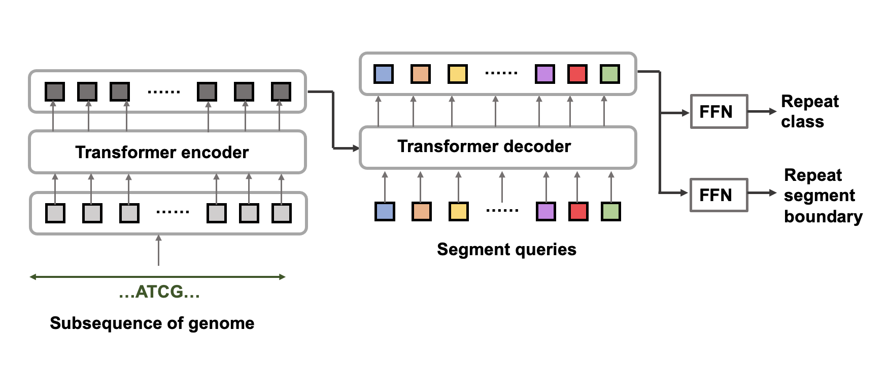
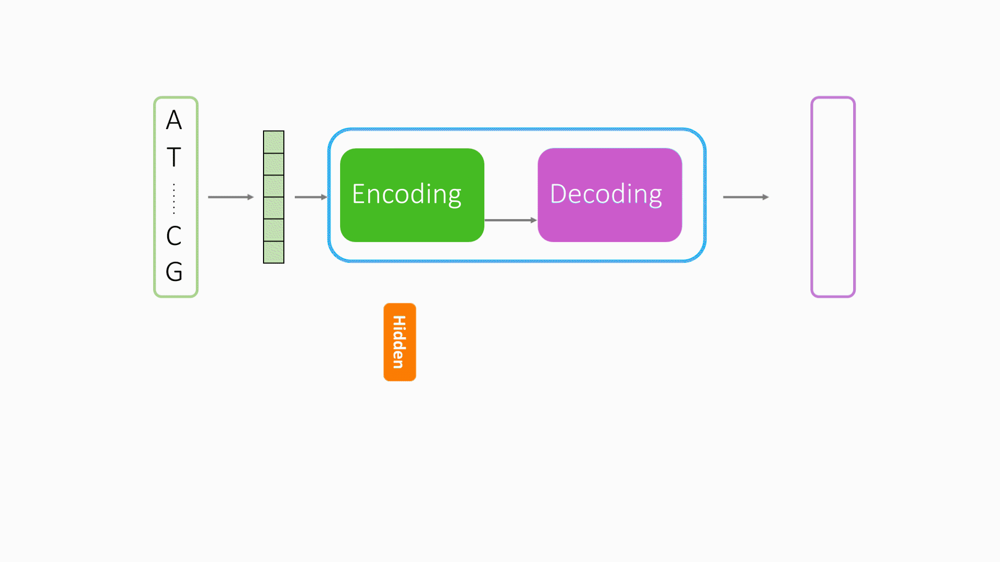

# Google Summer of Code-2022 : Ensembl-Repeat-Identification
#### A Deep Learning repository for predicting the `location` and `type` of repeat sequence in genome.

[](https://github.com/dwyl/esta/issues)

[](https://github.com/idealo/image-super-resolution/blob/master/LICENSE)
### Mentors : [Leanne Haggerty](https://www.linkedin.cn/incareer/in/leannehaggerty), [William Stark](https://www.linkedin.cn/incareer/in/williamstarkbio), [Jose Perez-Silva](https://www.linkedin.cn/incareer/in/jos%C3%A9-m%C2%AA-g-p%C3%A9rez-silva-b3959386), [Francesca Tricomi](https://www.linkedin.cn/incareer/in/francesca-tricomi-108916168) <br/><br/>

## Brief Description
A number of tools exist for identifying repeat features, but it remains a problem that the DNA sequence of some genes can be identified as being a repeat sequence. If such sequences are used to mask the genome, genes may be missed in the downstream annotation. Assuming that gene sequences have various signatures relating to their function and that repeats have different signatures including the repetitive nature of the signal itself, we want to train a classifier to separate the repeat sequences from the gene sequences. We are inspired by DETR, an object detection model, this project will use transformer structure to complete the identify repeat sequence task, our model will unify segmentation and classification into one like the object detection model.
## Network architecture

The input of the model is subsequence, and the output will be `where` and `type` of each subsequence. More data meaning can be found in [the visualization in the model](#the-visualization-in-the-model).
## Requirements:
1. A machine with atleast **8GB of RAM** (although **16-32GB** is recommended. A single GPU machine would suffice. The model can be trained on CPU as well but will be a lot faster if trained on a GPU.
2. A stable Internet Connection.
3. Set up a development environment with [pyenv](https://github.com/pyenv/pyenv) and [Poetry](https://github.com/python-poetry/poetry):
```shell
pyenv install 3.9.12

pyenv virtualenv 3.9.12 repeat_identification

poetry install
```

 ## Data Generation:
The model uses DNA sequence extract from  genome fasta file and its paired annotation as label as training data <br/>
**Download And Generate Required Files:**
In order to download and generate needed files should run:
```shell
python generate_dataset.py --species hg38 --configuration configuration.yaml
```
This script will simultaneously down genome assembly file and repeat annotations. The genome assembly file is the human reference genome `GRCh38` (called hg38 by Dfam), from the UCSC Genome Browser and the repeat annotations from [Dfam](https://www.dfam.org/home). It will generate a subset of the annotations by selecting the desired repeat family or subtype. 

All of the option can add personalized configuration by `configuration.yaml`. The dataset will be saved in the `data` folder, the contents should be like the following.

```shell
|____genome_assemblies
| |____hg38.fa.gz
| |____datasets
| | |____chr1.fa
...
| | |____*.fa
|____annotations
| |____hg38_chr1.csv
| |____repeat_families.json
...
| |____hg38_chr*.csv

```

<br/>


**Configuration Parameter:**<br/>
Some configuration should be defined in this stage.
```shell
# experiment files directory 
save_directory: experiments

# experiment naming prefix
experiment_prefix: standard
################################################################################

# dataset
################################################################################
chromosomes: ['chr1']
dataset_id: hg38
segment_length: 2000
overlap: 500
num_queries: 10
repeat_types: ["LTR", "DNA", "LINE", "SINE", "RC", "Retroposon", "PLE", "Satellite", "tRNA", "snRNA", "rRNA", "scRNA"]
################################################################################

```
Additionally, the length of subsequence can be defined by user, but it would not large than 4000.
<br/>

## Train the Model:

To train the model, run:<br/>
```shell
python train.py --configuration configuration.yaml
```

**Configuration Parameter:**<br/>
Additionally, some configuration should be defined in this stage.
```shell
# features
################################################################################
cost_class: 1
cost_segments: 1
cost_siou: 1
eos_coef: 1
iou_threshold: 0.5
################################################################################

# network architecture
################################################################################
################################################################################
embedding_dimension: 6
nhead: 6
num_encoder_layers: 1
num_decoder_layers: 1
# training
################################################################################
lr: 0.0001
max_epochs: 1
batch_size: 2
validation_ratio: 0.1
test_ratio: 0.1
max_norm: 0
seed: 42
dropout: 0.3
gpus: 0
loss_delta: 0
patience: 5
profiler: null
num_sample_predictions: 5
################################################################################

```
<br/>

## The visualization in the model:

Visualizing the predictions of the network will help us understand them better and debug and finetune the model, during testing, for a raw sequence we have its repeat annotation:
<br/>
```shell
raw sequence: AGAACCTATTATTTGCATGA'CATTCATGCATGC'TAGAAGAAACCTGTATTTTTTTCATCA
annotation: AGAACCTATTATTTGCATGA🥑🥑🥑🥑🥑🥑🥑🥑🥑🥑🥑🥑🥑TAGAAGAAACCTGTATTTTTTTCATCA
```

## Further step
After some experiments, we found the prediction results of the DETR model is not good, so we also explore the alternative way to identity repeat region, in here the vanilla transformer model is used.<br/>
**Alternative model architecture**

This model is simple than DETR, it take the raw DNA sequence as input, and it will produce the DNA sequence with the repeat region.
The visualized output looks like the following:
```shell
ground truth:AGAACCTATT🍓🍓🍓🍓🍓🍓TAGAAGAAA🍓🍓🍓🍓🍓🍓ATCAG
  prediction:**********🍓🍓🍓🍓🍓🍓*********🍓🍓🍓🍓🍓🍓*****
```
Each `*` represent the base is not repeat region, each `🍓` represent the repeat region include its type.
**Important note:**
The validation loss value is being calculated erroneously. The label is wrongly feeded into the validation stage, this is
what we should avoid, I will continue to fix it. 
## Research papers / References

1. [End-to-End Object Detection with Transformers
](https://arxiv.org/abs/2005.12872)
2. [Attention Is All You Need
](https://arxiv.org/abs/1706.03762)

